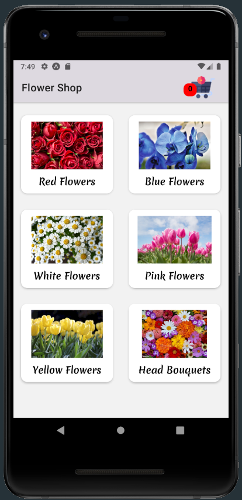
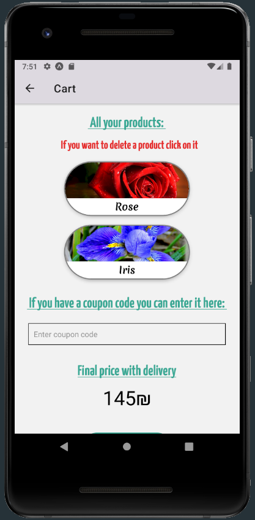
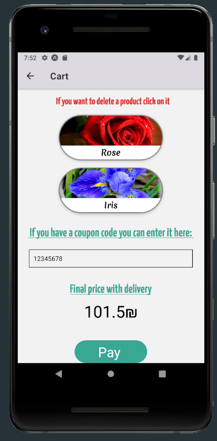
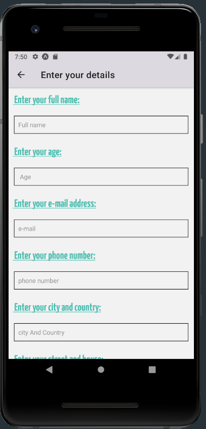

# README

## Flowers Store - React Native: 

  
# Screens :
### 1. Home Page

  
### 2. Producrs Page

  
### 3. Product Details

  
### 4. Cart Page

  
### 5. Cart & copun Page

  
### 6. Input User Details

  
### 6. Puraches was successful

  

> In the app we using 'dummy-data' for testing

 

### Coupon codes are:
 * 'MichaelShir100' - *10% discount*
 * 'SfMv100' - *25% discount*
 * '12345678' - *30% discount*

  
> NOTE: All rights reserved to to Shir Feldman and Michael Volfson